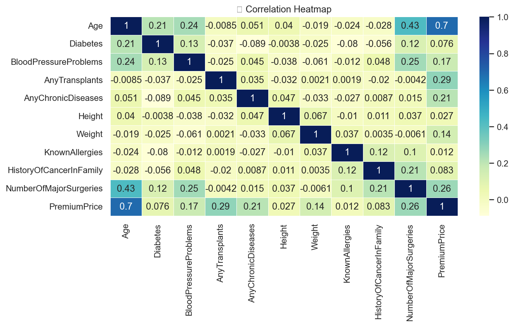
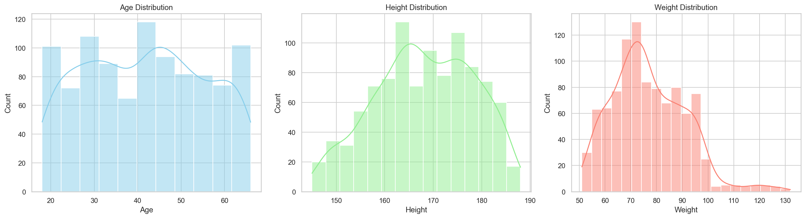
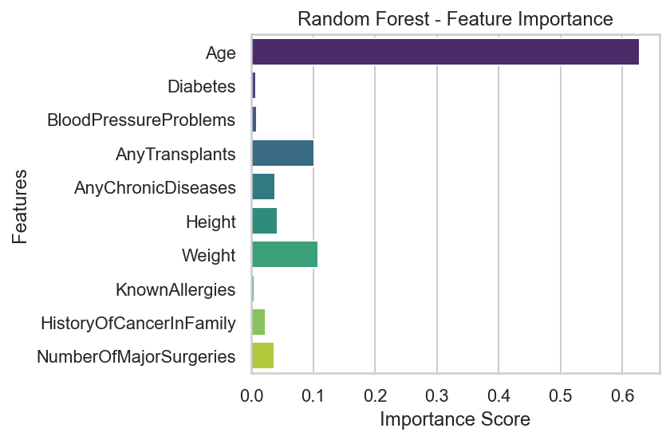

# 🩺 Medical Insurance Premium Prediction

This project uses machine learning models to predict **medical insurance premium prices** based on various personal and medical attributes. It evaluates and compares multiple regression models and visualizes important patterns within the data.

---

## 📁 Project Structure

```

medical\_insurance\_premium\_prediction/
│
├── Medicalpremium.csv             # Dataset
├── medical\_premium\_prediction.py  # Main Python script
├── README.md                      # Project documentation
├── images/
│   ├── correlation\_heatmap.png
│   ├── age\_height\_weight\_dist.png
│   ├── random\_forest\_importance.png
│   └── xgboost\_importance.png

````

---

## 📊 Dataset Features

The dataset consists of the following input features:

- `Age`
- `Height` (in cm)
- `Weight` (in kg)
- `Diabetes` (0 or 1)
- `BloodPressureProblems` (0 or 1)
- `AnyTransplants` (0 or 1)
- `AnyChronicDiseases` (0 or 1)
- `KnownAllergies` (0 or 1)
- `HistoryOfCancerInFamily` (0 or 1)
- `NumberOfMajorSurgeries` (integer)

**Target Variable:**
- `PremiumPrice` (float)

---

## 📈 Visualizations

### 🔗 Correlation Heatmap
Shows how features relate to each other and to the insurance premium price.



### 📊 Distributions of Age, Height, Weight



### 🌲 Random Forest - Feature Importance



### 🚀 XGBoost Regressor - Feature Importance


---

## 🧠 Models Compared

| Model               | R2 Score | MAE        | RMSE       |
|--------------------|----------|------------|------------|
| XGBRFRegressor     | 0.88     | 1287.63    | 2257.09    |
| Random Forest       | 0.88     | 1001.11    | 2298.39    |
| Linear Regression   | 0.71     | 2586.23    | 3495.95    |
| Lasso Regression    | 0.71     | 2587.23    | 3497.29    |
| Ridge Regression    | 0.71     | 2592.39    | 3503.41    |

✅ **XGBRFRegressor** performed the best overall.

---

## 🔮 Custom Prediction Example

```python
# Predict premium for a 35-year-old, 170cm tall, 72kg, 1 surgery
sample_input = pd.DataFrame([{
    'Age': 35,
    'Diabetes': 0,
    'BloodPressureProblems': 0,
    'AnyTransplants': 0,
    'AnyChronicDiseases': 0,
    'Height': 170,
    'Weight': 72,
    'KnownAllergies': 0,
    'HistoryOfCancerInFamily': 0,
    'NumberOfMajorSurgeries': 1
}])

# Scale the input
sample_input[['Age', 'Height', 'Weight']] = scaler.transform(sample_input[['Age', 'Height', 'Weight']])

# Predict using the trained XGBRFRegressor model
predicted_premium = model.predict(sample_input)[0]
````

**💰 Output:**
`Predicted Insurance Premium: 23152.41`

---
Not yet — but let's do that now.

Here’s a detailed explanation of each **output** section that appears in your script and terminal, which you can include in the `README.md` (under a section like `🔍 Output Analysis`) to make the project clearer to reviewers or collaborators:

---

## 🔍 Output Analysis

### ✅ Missing Values

```
Missing values:
Age                        0
Diabetes                   0
BloodPressureProblems      0
AnyTransplants             0
AnyChronicDiseases         0
Height                     0
Weight                     0
KnownAllergies             0
HistoryOfCancerInFamily    0
NumberOfMajorSurgeries     0
PremiumPrice               0
```

* No missing data, so we don't need to impute or drop any rows.
* Ensures clean input for machine learning models.

---

### 📊 Model Comparison

```
               Model  R2 Score          MAE         RMSE
4     XGBRFRegressor  0.880532  1287.632916  2257.087587
3      Random Forest  0.876120  1001.111111  2298.387885
0  Linear Regression  0.713394  2586.225384  3495.949328
1              Lasso  0.713175  2587.226435  3497.288202
2              Ridge  0.712170  2592.390681  3503.411796
```

**Interpretation:**

* `R2 Score`: Measures how well the model explains variance in `PremiumPrice` (1 = perfect).
* `MAE`: Average error in prediction — lower is better.
* `RMSE`: Root Mean Squared Error — penalizes large errors more than MAE.

**Best model:**
✅ `XGBRFRegressor` performs best (highest R²), although `Random Forest` has slightly lower MAE — a strong candidate too.

---

### 📈 Feature Importance (via Bar Plots)

* **Random Forest** and **XGBoost** both highlight which features most influence insurance premium predictions.

Typical top contributors (based on your dataset — confirmed via bar plots):

* `Age`: Older individuals likely face higher premiums.
* `NumberOfMajorSurgeries`: A direct proxy for risk.
* `Weight` and `Height`: Proxy for BMI/obesity-related risks.
* `ChronicDiseases`, `Diabetes`: Significant in health-based pricing.

---

### 💰 Prediction Output

```
💰 Predicted Insurance Premium: 23152.41
```

**Input:**

```python
{
  'Age': 35,
  'Height': 170,
  'Weight': 72,
  'Diabetes': 0,
  'BloodPressureProblems': 0,
  'AnyTransplants': 0,
  'AnyChronicDiseases': 0,
  'KnownAllergies': 0,
  'HistoryOfCancerInFamily': 0,
  'NumberOfMajorSurgeries': 1
}
```

**Explanation:**

* For a relatively healthy 35-year-old with average height/weight and **1 major surgery**, the model predicts a premium of **23,152.41**.
* You can update these values to simulate different health profiles and test how the premium changes.

---

### ⚠️ Warnings (Non-critical)

* **UserWarning: Glyph 128279 missing from font(s)**
  → Emoji in titles (like 🔗) may not render depending on your OS/fonts — purely aesthetic.

* **FutureWarning: `palette` without `hue`**
  → Seaborn will change default behavior in v0.14; current plots still work fine. No impact now.

---

## 🛠️ Dependencies

* Python 3.7+
* pandas
* numpy
* seaborn
* matplotlib
* scikit-learn
* xgboost

---

## 📌 Notes

* The project uses feature scaling for continuous variables.
* You can modify the input for predictions based on different patient profiles.
* All code is executed in `medical_premium_prediction.py`.

---

## 📬 Author

**Basil Rehan**
Data Analyst | Actuarial Science & Data Science Student
📍 Dubai

```
