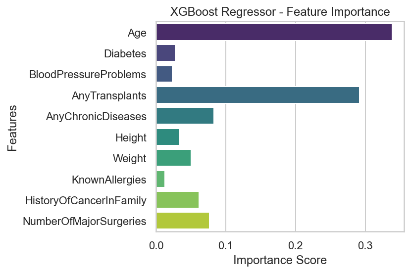

# 🩺 Medical Insurance Premium Prediction

This project uses machine learning models to predict **medical insurance premium prices** based on various personal and medical attributes. It evaluates and compares multiple regression models and visualizes important patterns within the data.

---

## 📁 Project Structure

```

medical\_insurance\_premium\_prediction/
│
├── Medicalpremium.csv             # Dataset
├── medical\_premium\_prediction.py  # Main Python script
├── README.md                      # Project documentation
├── images/
│   ├── correlation\_heatmap.png
│   ├── age\_height\_weight\_dist.png
│   ├── random\_forest\_importance.png
│   └── xgboost\_importance.png

````

---

## 📊 Dataset Features

The dataset consists of the following input features:

- `Age`
- `Height` (in cm)
- `Weight` (in kg)
- `Diabetes` (0 or 1)
- `BloodPressureProblems` (0 or 1)
- `AnyTransplants` (0 or 1)
- `AnyChronicDiseases` (0 or 1)
- `KnownAllergies` (0 or 1)
- `HistoryOfCancerInFamily` (0 or 1)
- `NumberOfMajorSurgeries` (integer)

**Target Variable:**
- `PremiumPrice` (float)

---

## 📈 Visualizations

### 🔗 Correlation Heatmap
Shows how features relate to each other and to the insurance premium price.


### 📊 Distributions of Age, Height, Weight


### 🌲 Random Forest - Feature Importance


### 🚀 XGBoost Regressor - Feature Importance



---

## 🧠 Models Compared

| Model               | R2 Score | MAE        | RMSE       |
|--------------------|----------|------------|------------|
| XGBRFRegressor     | 0.88     | 1287.63    | 2257.09    |
| Random Forest       | 0.88     | 1001.11    | 2298.39    |
| Linear Regression   | 0.71     | 2586.23    | 3495.95    |
| Lasso Regression    | 0.71     | 2587.23    | 3497.29    |
| Ridge Regression    | 0.71     | 2592.39    | 3503.41    |

✅ **XGBRFRegressor** performed the best overall.

---

## 🔮 Custom Prediction Example

```python
# Predict premium for a 35-year-old, 170cm tall, 72kg, 1 surgery
sample_input = pd.DataFrame([{
    'Age': 35,
    'Diabetes': 0,
    'BloodPressureProblems': 0,
    'AnyTransplants': 0,
    'AnyChronicDiseases': 0,
    'Height': 170,
    'Weight': 72,
    'KnownAllergies': 0,
    'HistoryOfCancerInFamily': 0,
    'NumberOfMajorSurgeries': 1
}])

# Scale the input
sample_input[['Age', 'Height', 'Weight']] = scaler.transform(sample_input[['Age', 'Height', 'Weight']])

# Predict using the trained XGBRFRegressor model
predicted_premium = model.predict(sample_input)[0]
````

**💰 Output:**
`Predicted Insurance Premium: 23152.41`

---

## 🛠️ Dependencies

* Python 3.7+
* pandas
* numpy
* seaborn
* matplotlib
* scikit-learn
* xgboost

---

## 📌 Notes

* The project uses feature scaling for continuous variables.
* You can modify the input for predictions based on different patient profiles.
* All code is executed in `medical_premium_prediction.py`.

---

## 📬 Author

**Basil Rehan**
Data Analyst | Actuarial Science & Data Science Student
📍 Dubai

```
